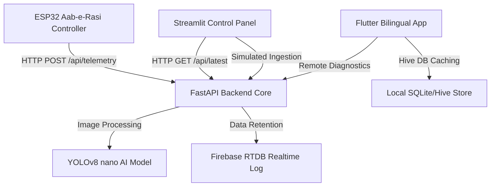

# 🌾 Project GeoKisan / GeoFarmer (زرعی سپراپلی کیشن)

### Precision Agriculture IoT & AI Super-App Suite

Welcome to the production repository for **GeoKisan / GeoFarmer**, an advanced, bilingual precision-agriculture software ecosystem designed to empower farmers across Pakistan with real-time IoT diagnostics, AI-driven crop pathology analysis, water flow metering, and wholesale market intelligence.

---

## 🏗️ Integrated Architecture Overview



---

## 📂 Project Workspace Layout

*   **[`backend/`](file:///f:/.Hackathon/0.GeoFarmer/backend/)**: Exposes the FastAPI REST API, handles CORS middleware, telemetry databasing (`/api/telemetry`, `/api/latest`), crop leaf disease classifications (`/detect`) with automated severity scaling, and coordinates the YOLOv8 model training loop script ([`train.py`](file:///f:/.Hackathon/0.GeoFarmer/backend/train.py)).
*   **[`dashboard/`](file:///f:/.Hackathon/0.GeoFarmer/dashboard/)**: Streamlit operations panel configured with custom HSL-tailored branding tokens (Primary Field Green, Harvest Gold, Canal Blue, Clay Earth), featuring visual meters and telemetry data simulations.
*   **[`firmware/`](file:///f:/.Hackathon/0.GeoFarmer/firmware/)**: Arduino C++ microcode ([`esp32_wifi.ino`](file:///f:/.Hackathon/0.GeoFarmer/firmware/esp32_wifi.ino)) for Aab-e-Rasi irrigation controllers with built-in pump fail-safes and periodic HTTP POST routines.
*   **[`frontend/`](file:///f:/.Hackathon/0.GeoFarmer/frontend/)**: Bilingual dynamic Flutter application with full Left-to-Right English (`DM Sans`/`Playfair Display`) and Right-to-Left Urdu (`Noto Nastaliq Urdu` $\ge 16$sp) localizations supporting all 30 sub-systems across 10 functional groupings.

---

## 🎨 UI/UX Design System Specifications (`geokisan-*`)

| Token Name | Hex Code | Utility / Visual State |
| :--- | :--- | :--- |
| `geokisan-primary-green` | `#4A7C2F` | Field Green — Core navigation elements, active status states |
| `geokisan-ai-gold` | `#C8860A` | Harvest Gold — AI chatbot widgets, disease summaries |
| `geokisan-water-blue` | `#1A6B8A` | Canal Blue — Hydration metrics, Weather graphs, Sensor readouts |
| `geokisan-alert-clay` | `#8B4513` | Clay Earth — Emergency hazard panels, NDMA/PMD warning banners |
| `geokisan-bg-dark` | `#1C2410` | Deep Soil — Primary dark mode theme context canvas |
| `geokisan-surface-cream` | `#FAF8F3` | Off-white Cream — Component background cards (prevents outdoor glare) |

---

## ⚡ Quick Start & Execution Guide

### 1. Telemetry Backend
Configure dependencies and boot the FastAPI Uvicorn engine:
```bash
cd backend
pip install -r requirements.txt
python main.py
```
*Port listeners will spin up at `http://localhost:8000`.*

### 2. Operations Dashboard
Launch the reactive monitoring panel:
```bash
cd dashboard
pip install streamlit requests plotly numpy
streamlit run dashboard.py
```
*Accessible in your browser at `http://localhost:8501`.*

### 3. Mobile Frontend Setup
Set up the Flutter bilingual client packages:
```bash
cd frontend
flutter pub get
flutter run
```

---

## 🔒 Edge Infrastructure Safeguard Policies
1.  **Aab-e-Rasi Fail-Safe Setup:** The digital line governing the physical water pump irrigation relay is explicitly programmed to boot to a forced `LOW` state during the ESP32 setup phase. This provides a hard hardware safeguard against continuous crop flooding on sudden power interruptions.
2.  **RTL Mathematical Integrity:** Numerical values, coordinates, and prices preserve Western/Latin digits inside the Urdu translation context to guarantee calculation and verification accuracy.
